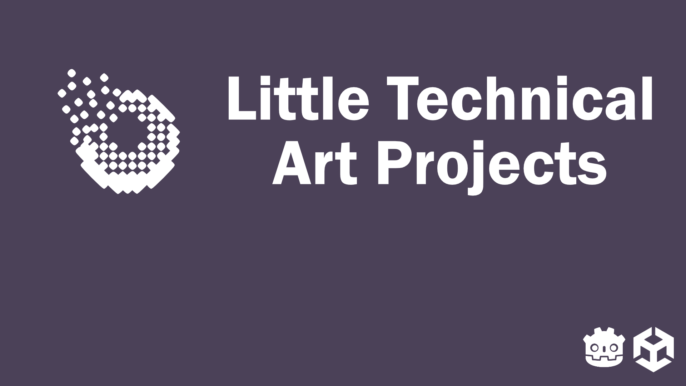
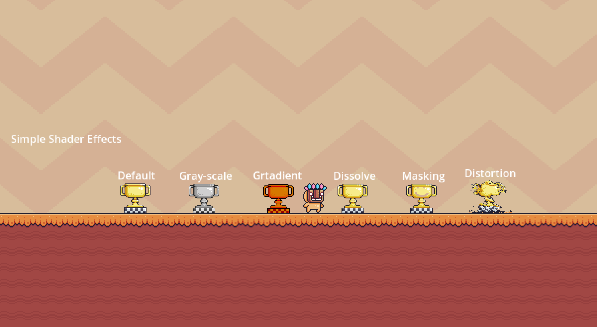
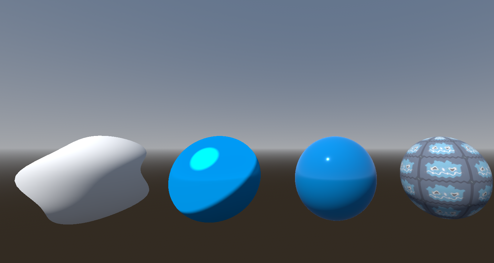
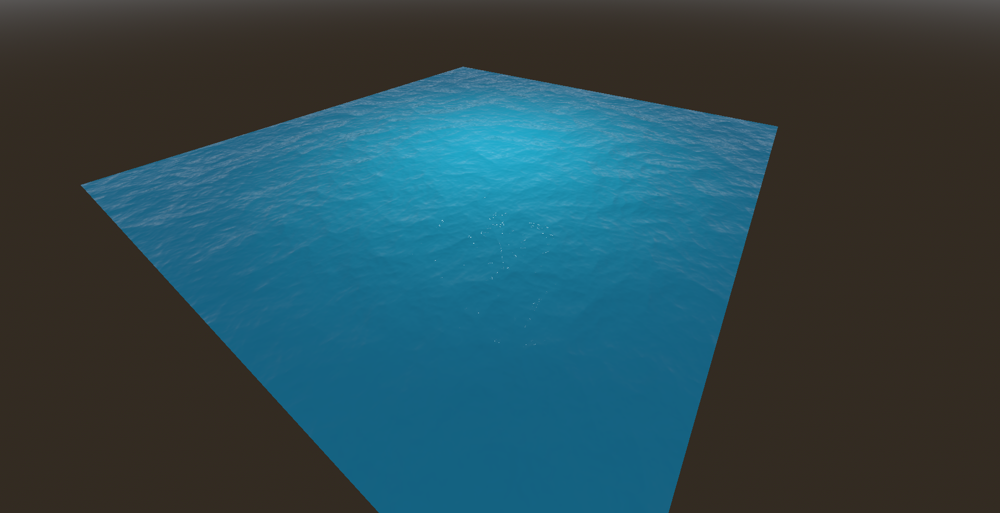

# Techcnical Art Projects
In this repository you can find different kind of techincal art projects. This is not the final form of these projects. This is just a prototype version of these shaders witch I am going to implement in my games, or in my own rendering engine.  

# Getting started
The projects are created mainly in Godot and Unity. In the catalog I'll annotate wich version do you need to run those projects.

# Projects
## 00 - ShaderCourse(GameDevTV) <Godot 4.2.1>
This project is a course by GameDev.TV [The course](https://www.gamedev.tv/courses/godot-shaders) is teached me the fundamentals of shader devlopment in Godot 4. This course is cover 2D and 3D shaders.
Topic covered:
- Vertex Shaders
- Fragment Shaders
- Tiling
- Grayscale
- Gradient Colors
- Masking
- Texture Scrolling
- Normal Maps    
**Scrennshots:**

## 00 - ShaderGraphBasics <Unity 2022.3.40f>
This the tutorial code of the BenCloward's tutorials.

## 01 - 3D Shaders Collection <Godot 4.2.1>
These are my own developed 3D shaders in godot. In this project there is only one scene, where every shader I devloped is there.

### Wet Stone Shader
I created a simple stone shader. The developers have a control over the moisture on the stone surface. I get a PBR materiial from Polyhaven. After I applied on a model created in belnder I modified different parameters of the material based on some noise texture.   
**Scrennshots:**

### Procedural Mosaic Shader
